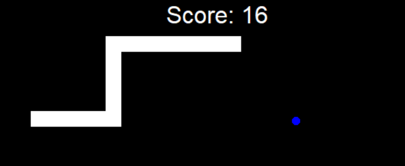

# Snake Arcade Game

Description in english and portuguese br

Today we are going to learn how to build our first arcade game, the snake game!
We will make use of the Turtle library again, to show and reinforce that it does not necessarily have to do something involving turtles, we can manipulate the Turtle class and the others to create our own games


 


## What will this project do?
For this project, class inheritance, splitting, object orientation, classes and the use of the Turtle module and its classes to create classic games will be exercised. With all the projects done so far, it's perfectly doable.

### Orientation
Fortunately, today chatgpt exists, so if you need to know how to do each part, get the codes inside the files, throw them into chatgpt and it will explain it to you in detail, however try to do it yourself! study classes, study objects, study the turtle module, and understand how you can play the snake game.

Initially you will need to create 3 turtles objects in the shape of squares and position them one behind the other to assume the shape of the snake, don't forget to design a nice canvas size, in this case I used 600x600, and put black in the background and white in the 3 squares. Afterwards, you will need to make the 3 objects move, they will be the snake, and for that I played the function that will make the snake move inside a while, so it will always continue to move until the time the player loses; to train classes and objects, I played the movement functions of the snake and the squares created to represent it inside the file [snake.py](snake.py), if you get confused with the logic used, ask an artificial intelligence. Then I programmed the button presses, something we already saw in project 19, and they will invoke functions within the Snake class to change the direction of the first square (note that, thanks to the movement function within the class, the other blocks will follow the first one, so we just need to change the first one), and I also ensured that the user would not be able to make the snake turn in the opposite direction, for that I only needed an IF.

### Next steps
Make a collision system with food to increase it by one square, then create a dashboard, then a collision system with the wall for the user to lose, and finally a collision system for the squares that form the snake so that the user loses too (as you already know, you always lose in this game, its objective is always to try to break your record).
Remember that to inherit a class, we need to create a class, and in the new class that will inherit it, reference it.
Example
```
class Test:
    def __init__(self):
        ...

class second(Test): # this class will inherit the Test class
    def __init__(self):
        super().__init__()
        ...
```
We'll use inherited classes to create a class just for the snake's food that will inherit some methods and attributes from the Turtle class to speed up our work.

For the Scoreboard we will use the write method of the Turtle class, and we'll do that in another new class called scoreboard.py that will follow the inherited class model as well.


## [Main Script](main.py)

### Description:

This script orchestrates the Snake game. It initializes the game window, manages user inputs, checks for game-ending conditions, and updates the game at regular intervals.

### Features:

- **Responsive Controls:** Use `W`, `A`, `S`, `D` for movement.
- **Food Consumption:** The snake can eat food which helps it grow.
- **Dynamic Scoreboard:** Keeps track of your current score.
- **Game-Ending Conditions:** Ends the game if the snake collides with the game boundary or itself.

## Additional Files:

1. **[Snake Script snake.py)](snake.py):** 
   - Defines the snake's body, its motion, and the way it grows.
   - Controls the direction and logic for extending the snake.

2. **[Food Script (food.py)](food.py):** 
   - Represents the food object in the game.
   - Generates food at random positions within the game boundary.

3. **[Scoreboard Script (scoreboard.py)](scoreboard.py):** 
   - Manages and displays the current score.
   - Displays "Game Over" upon game ending conditions.

## Gameplay:

1. Execute the `main.py` script.
2. Control the snake using the `W`, `A`, `S`, `D` keys.
3. Try to eat the food (blue circle). Each time you eat, your score increases and the snake grows longer.
4. Avoid running into the game boundary and the snake itself.
5. Aim to achieve the highest score possible!

## Requirements:

- Python
- Turtle Module (Standard in Python)


# Jogo Arcade da Cobrinha

Hoje vamos aprender a construir nosso primeiro jogo de fliperama, o jogo da cobra!
Faremos uso novamente da biblioteca Turtle, para mostrar e reforçar que não necessariamente tem que fazer algo envolvendo tartarugas, podemos manipular a classe Turtle e as demais para criarmos nossos próprios jogos


## O que este projeto fará?
Para este projeto serão exercitados herança de classes, splitting, orientação a objetos, classes e o uso do módulo Turtle e suas classes para criação de jogos clássicos. Com todos os projetos feitos até agora, é perfeitamente factível.

### Orientação
Felizmente, hoje existe o chatgpt, então se você precisa saber como fazer cada parte, pegue os códigos dentro dos arquivos, jogue no chatgpt e ele te explicará detalhadamente, porém tente fazer você mesmo! estude as aulas, estude os objetos, estude o módulo da tartaruga e entenda como você pode jogar o jogo da cobra.

Inicialmente você vai precisar criar 3 objetos tartarugas no formato de quadrados e posicioná-los um atrás do outro para assumir o formato da cobra, não esqueça de desenhar um tamanho de canvas legal, neste caso usei 600x600, e coloquei preto no fundo e branco nos 3 quadrados. Depois, você precisará fazer os 3 objetos se moverem, eles serão a cobra, e para isso fiz a função que fará a cobra se mover dentro de um tempo, então ela sempre continuará se movendo até o tempo que o jogador perder; para treinar classes e objetos, joguei as funções de movimento da cobra e os quadrados criados para representá-la dentro do arquivo [snake.py](snake.py), se você se confundir com a lógica usada, pergunte a uma inteligência artificial. Então programei os pressionamentos de botões, algo que já vimos no projeto 19, e eles vão invocar funções dentro da classe Snake para mudar a direção do primeiro quadrado (note que, graças à função de movimento dentro da classe, os outros blocos seguirão o primeiro, então só precisamos mudar o primeiro), e também garanti que o usuário não conseguiria fazer a cobra virar na direção oposta, para isso eu só precisava de um IF.

### Próximos passos
Faça um sistema de colisão com a comida para aumentá-la em um quadrado, depois crie um painel, depois um sistema de colisão com a parede para o usuário perder e por último um sistema de colisão para os quadrados que formam a cobra para que o usuário perca também ( como você já sabe, você sempre perde neste jogo, seu objetivo é sempre tentar quebrar seu recorde).
Lembre-se que para herdar uma classe, precisamos criar uma classe, e na nova classe que irá herdá-la, referenciá-la.
Exemplo
```
teste de classe:
    def __init__(self):
        ...

class second(Test): # esta classe herdará a classe Test
    def __init__(self):
        super().__init__()
        ...
```
Usaremos classes herdadas para criar uma classe apenas para a comida da cobra que herdará alguns métodos e atributos da classe Tartaruga para agilizar nosso trabalho.

Para o Scoreboard, usaremos o método write da classe Turtle e faremos isso em outra nova classe chamada scoreboard.py que também seguirá o modelo de classe herdado.


## [Script Principal](main.py)

### Descrição:

Este script orquestra o jogo Snake. Ele inicializa a janela do jogo, gerencia as entradas do usuário, verifica as condições de finalização do jogo e atualiza o jogo em intervalos regulares.

### Características:

- **Controles responsivos:** Use `W`, `A`, `S`, `D` para o movimento.
- **Consumo de Alimentos:** A cobra pode comer alimentos que a ajudam a crescer.
- **Placar Dinâmico:** Mantém o controle de sua pontuação atual.
- **Condições de fim de jogo:** termina o jogo se a cobra colidir com os limites do jogo ou com ela mesma.

## Arquivos Adicionais:

1. **[Snake Script snake.py)](snake.py):**
   - Define o corpo da cobra, seu movimento e a forma como ela cresce.
   - Controla a direção e lógica para estender a cobra.

2. **[Food Script (food.py)](food.py):**
   - Representa o objeto de comida no jogo.
   - Gera comida em posições aleatórias dentro do limite do jogo.

3. **[Scoreboard Script (scoreboard.py)](scoreboard.py):**
   - Gerencia e exibe a pontuação atual.
   - Exibe "Game Over" nas condições de finalização do jogo.

   ## Jogabilidade:

1. Execute o script `main.py`.
2. Controle a cobra usando as teclas `W`, `A`, `S`, `D`.
3. Tente comer a comida (círculo azul). Cada vez que você come, sua pontuação aumenta e a cobra cresce mais.
4. Evite correr para o limite do jogo e a própria cobra.
5. Procure alcançar a maior pontuação possível!

## Requisitos:

- Python
- Módulo Turtle (Padrão em Python)