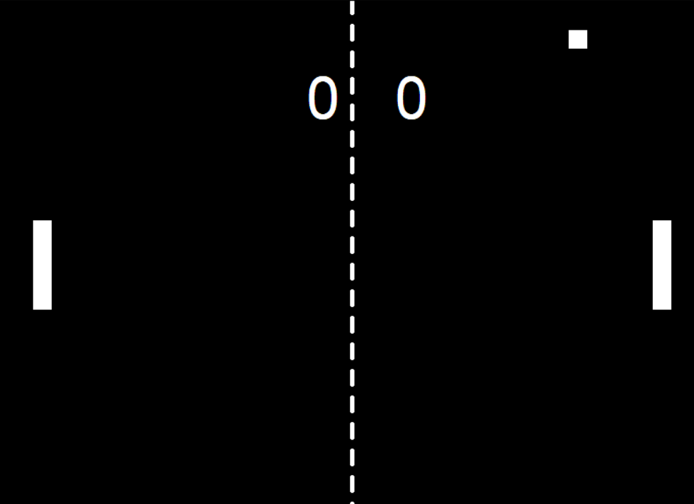

# Pong Game

Description in English and Portuguese-BR

A remake of the classic Pong game, using Python and the Turtle library. This project is a fantastic opportunity to learn about object-oriented programming, classes, inheritance, and other key development techniques.

 

## Features

- Simple and sleek graphics.
- Smooth gameplay.
- Precise ball and paddle collisions.
- Scoreboard that tracks player points.
- Ball reverses direction when colliding with a wall or paddle.
- Fluid paddle movement using keyboard keys.

## How to Play

1. Run the `main.py` file to start the game.
2. The left player uses the `W` key to move up and the `S` key to move down.
3. The right player uses the `↑` arrow key to move up and the `↓` arrow key to move down.
4. Players try to bounce the ball back to the opposing side. If the ball passes a player's paddle, the opponent scores a point.
5. The ball increases in speed after each bounce, making the game progressively challenging.
6. Enjoy and challenge your friends!

## Programming Concepts Covered

This project is a great resource for those looking to learn or teach object-oriented programming. Some of the concepts covered include:

- **Classes and Objects**: The game is built around several classes defining the players, ball, and scoreboard.
- **Inheritance**: Used to extend the functionality of base classes provided by the Turtle library.
- **Methods and Attributes**: Classes have various methods controlling object behavior and attributes maintaining game state.
- **Encapsulation**: Implementation details of the classes are hidden, and only necessary interfaces are exposed.
- **Game Loop**: A main loop controlling game updating and rendering.

## Contributions

Feel free to fork this repository, create a branch, make changes, and submit pull requests.

# Jogo Pong

Um remake do clássico jogo Pong, utilizando Python e a biblioteca Turtle. Este projeto é uma excelente oportunidade para aprender sobre programação orientada a objetos, classes, herança, e outras importantes técnicas de desenvolvimento.

## Características

- Gráficos simples e elegantes.
- Jogabilidade suave.
- Colisões precisas entre a bola e as raquetes.
- Placar que rastreia os pontos dos jogadores.
- A bola inverte a direção quando colide com uma parede ou raquete.
- Movimento fluído das raquetes utilizando teclas do teclado.

## Como Jogar

1. Execute o arquivo `main.py` para iniciar o jogo.
2. O jogador da esquerda usa as teclas `W` para subir e `S` para descer.
3. O jogador da direita usa a seta para cima `↑` para subir e a seta para baixo `↓` para descer.
4. Os jogadores tentam rebater a bola de volta para o lado adversário. Se a bola passar pela raquete de um jogador, o adversário ganha um ponto.
5. A bola aumenta sua velocidade após cada rebatida, tornando o jogo progressivamente mais desafiador.
6. Divirta-se e desafie seus amigos!

## Conceitos de Programação Utilizados

Este projeto é um ótimo recurso para aqueles que desejam aprender ou ensinar programação orientada a objetos. Alguns dos conceitos incluem:

- **Classes e Objetos**: O jogo é construído em torno de várias classes que definem os jogadores, a bola e o placar.
- **Herança**: Usada para estender a funcionalidade das classes base fornecidas pela biblioteca Turtle.
- **Métodos e Atributos**: As classes têm vários métodos para controlar o comportamento dos objetos e atributos que mantêm o estado do jogo.
- **Encapsulamento**: Os detalhes de implementação das classes são ocultados e apenas as interfaces necessárias são expostas.
- **Loop de Jogo**: Um loop principal que controla a atualização e renderização do jogo.

## Contribuições

Sinta-se à vontade para fazer fork deste repositório, criar um branch, fazer alterações e submeter pull requests.

