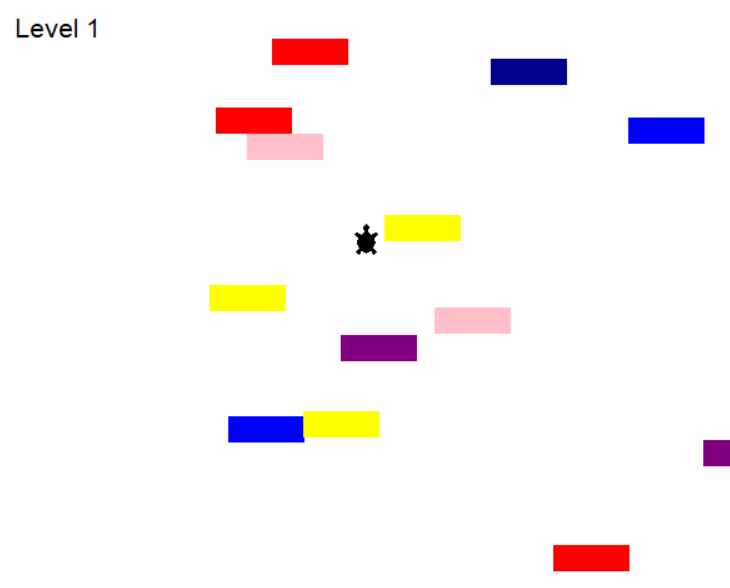

# Turtle Crossing Game

This is a road crossing game, inspired by the classic Frogger, using the Turtle module in Python. We will continue to practice what we had done so far training classes, inheritance, objects and the use of the Turtle tool for GUI.

 

## Table of Contents

1. [How to Play](#how-to-play)
2. [Configuration and Requirements](#configuration-and-requirements)
3. [Code Structure](#code-structure)
4. [Python Object-Orientation](#python-object-orientation)
5. [Credits](#credits)

## How to play

Upon starting the game, the player controls a turtle that starts at the bottom of the screen. The objective is to successfully cross to the top of the screen while avoiding horizontally moving blocks.

- Use "Up" key to move the turtle up.
- Use "Down" key to move the turtle down.

If the turtle collides with a block, the game is over. Each time the turtle reaches the top, it resets at the bottom and the difficulty (speed of blocks) increases.

## Configuration and Requirements

- Python
- Turtle module (default in Python)

Clone this repository and run `main.py` to start the game.

## Code Structure

The project is divided into several modules for better organization and readability:

- `main.py`: Game entry point. Initializes the game and controls the main loop.
- `player.py`: Defines the turtle, which is controlled by the player.
- `blocks.py`: Defines blocks that move horizontally.
- `scoreboard.py`: Displays and manages the player's score.

## Object Orientation in Python

This project is a practical example of how object-oriented programming (OOP) is used in Python. OOP lets you model real-world entities using classes and objects.

- **Class**: It is a prototype to create objects. Defines the attributes and methods your objects will have.
- **Object**: It is an instance of a class.

In this project:

- The `Player` (turtle) and `Blocks` are classes that inherit from the base class `Turtle`.
- Methods like `go_ahead` in `Player` are functions defined inside a class that operate on attributes of that class.
- We use the `__init__` constructor to initialize the attributes of an object at creation time.

To learn more about OOP in Python, [see the official documentation](https://docs.python.org/3/tutorial/classes.html).

## Credits

* Game developed by StanleyTC. Inspired by classic games and built for educational purposes.
* Ascii skull art sourced from: https://textart4u.blogspot.com/2013/05/game-over-text-art.html

# Turtle Crossing Game

Este é um jogo de atravessar a estrada, inspirado no clássico Frogger, usando o módulo Turtle em Python. Iremos continuar a praticar o que já haviamos feito até então treinando classes, heranças, objetos e o uso da ferramenta Turtle para GUI.

## Tabela de Conteúdos

1. [Como Jogar](#como-jogar)
2. [Configuração e Requisitos](#configuração-e-requisitos)
3. [Estrutura do Código](#estrutura-do-código)
4. [Orientação a Objetos em Python](#orientação-a-objetos-em-python)
5. [Créditos](#créditos)

## Como Jogar

Ao iniciar o jogo, o jogador controla uma tartaruga que começa na parte inferior da tela. O objetivo é atravessar com sucesso para o topo da tela, evitando blocos que se movem horizontalmente.

- Use a tecla "Up" para mover a tartaruga para cima.
- Use a tecla "Down" para mover a tartaruga para baixo.

Se a tartaruga colidir com um bloco, o jogo termina. Cada vez que a tartaruga alcança o topo, ela é redefinida na parte inferior e a dificuldade (velocidade dos blocos) aumenta.

## Configuração e Requisitos

- Python
- Módulo Turtle (padrão no Python)

Clone este repositório e execute `main.py` para começar o jogo.

## Estrutura do Código

O projeto é dividido em vários módulos para melhor organização e legibilidade:

- `main.py`: Ponto de entrada do jogo. Inicializa o jogo e controla o loop principal.
- `player.py`: Define a tartaruga, que é controlada pelo jogador.
- `blocks.py`: Define os blocos que se movem horizontalmente.
- `scoreboard.py`: Exibe e gerencia a pontuação do jogador.

## Orientação a Objetos em Python

Este projeto é um exemplo prático de como a programação orientada a objetos (POO) é usada em Python. A POO permite modelar entidades do mundo real usando classes e objetos.

- **Classe**: É um protótipo para criar objetos. Define os atributos e métodos que seus objetos terão.
- **Objeto**: É uma instância de uma classe.

Neste projeto:

- A `Player` (tartaruga) e `Blocks` são classes que herdam da classe base `Turtle`.
- Métodos como `go_ahead` em `Player` são funções definidas dentro de uma classe que operam em atributos dessa classe.
- Usamos o construtor `__init__` para inicializar os atributos de um objeto no momento da criação.

Para aprender mais sobre POO em Python, [veja a documentação oficial](https://docs.python.org/3/tutorial/classes.html).

## Créditos

* Jogo desenvolvido por StanleyTC. Inspirado por jogos clássicos e construído para fins educacionais.
* Ascii arte de caveira obtida em: https://textart4u.blogspot.com/2013/05/game-over-text-art.html